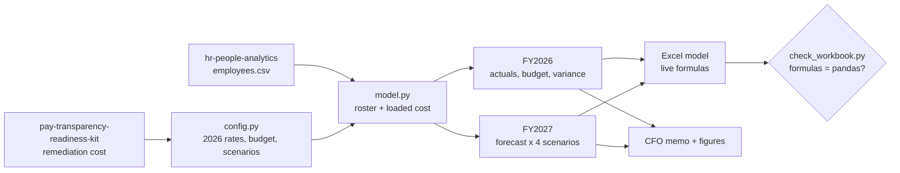

# Workforce Cost Model

What does a person really cost in Milan and in Kraków, why did last year's people budget
overrun, and what will next year cost if the company freezes hiring, loses more people or starts
closing its pay gaps? This repository answers those questions for a two-country employer **as an
HR-finance team would**: a driver-based Excel model with live formulas, a memo to the finance
director, and one reproducible pipeline that checks every figure twice.

[](https://github.com/D0M3N1C0X/workforce-cost-model/actions/workflows/ci.yml)


> **Synthetic company, real rules.** The employees are the organisation analysed in
> [hr-people-analytics](https://github.com/D0M3N1C0X/hr-people-analytics); the budget, growth
> plans and pay review are invented. Italian and Polish employer costs follow the 2026 rules,
> each with its source and status in the [verification register](docs/verification.md). Not
> payroll or tax advice.

### ▶ [Read the memo online](https://d0m3n1c0x.github.io/workforce-cost-model/) · [Download the Excel model](https://github.com/D0M3N1C0X/workforce-cost-model/raw/main/deliverables/workforce_cost_model.xlsx)

---

## The answer, for the finance director

| | |
|---|---|
| **FY2026 closed €5.8M (5.7%) over budget, at €107.1M**, for 2,128 FTE on average. Volume explains it: headcount ahead of plan added €6.3M. | **A fully loaded employee costs €59,382 per FTE in Milan and €41,727 in Kraków.** In Poland, 79 people earn above the 282,600 PLN cap on pension and disability contributions. |
| **FY2027 costs €111.0M in the base case (+3.6%)**: more FTE and the January pay review. | **A hiring freeze from October cuts it to €104.6M**, but the year ends with 278 fewer FTE: a capacity decision, not a finance one. |
| **Higher attrition barely moves payroll** but lifts recruitment cost to €1.54M. | **Closing pay gaps from January 2027 adds €0.76M** to FY2027 and €1.52M a year after, using the gaps found by [pay-transparency-readiness-kit](https://github.com/D0M3N1C0X/pay-transparency-readiness-kit). |


---

## What you get

| Deliverable | For | What is in it |
|---|---|---|
| [`workforce_cost_model.xlsx`](deliverables/workforce_cost_model.xlsx) | the finance team | Fourteen sheets: dashboard with a scenario picker, scenario summary and bridge, FY2026 variance, actuals and budget, FY2027 drivers, one forecast sheet per scenario, the employee roster, settings and a reconciliation sheet. **Every figure is a live formula**: change a contribution rate, an attrition multiplier or a hiring-freeze month and the model recalculates. |
| [`cfo_memo.md`](reports/cfo_memo.md) | the finance director | Answer first: where the FY2026 budget went, what an employee costs in each country, FY2027 under four scenarios, five recommendations, method and limits. |
| [`docs/method.md`](docs/method.md) · [`docs/verification.md`](docs/verification.md) | reviewers | Every formula and simplification; the source and status of every rate and cap. |

## What this project demonstrates

| HR and payroll | Finance and analytics | Delivery and engineering |
|---|---|---|
| Employer cost in two systems: INPS and TFR in Italy; ZUS, the annual 30-times cap, Labour Fund, FGŚP and PPK in Poland | Budget against actual with a volume, mix and rate variance that adds up exactly | A client-ready Excel model: inputs in blue, formulas in black, key assumptions in yellow, one Settings sheet, a scenario picker, no dynamic arrays |
| Attrition, time to hire and replacement as forecast drivers | A month-by-month driver-based forecast under four scenarios, with a bridge from last year | **Two engines, one answer:** pandas and Excel formulas reconciled on 570 checks, recalculated in CI by LibreOffice |
| Pay-equity remediation priced with employer on-costs | Recruitment cost kept apart from payroll, so attrition shows its real price | Deterministic outputs, tests for every identity, a verification register for every rate |

## How it fits together



## Run it

```bash
python3 -m venv .venv && . .venv/bin/activate
pip install -r requirements.txt
python src/run_all.py        # a few seconds
```

Tests, including a sample workbook calculated in pure Python and checked against pandas
(about a minute and a half):

```bash
pip install -r requirements-dev.txt
pytest
```

The full workbook is recalculated by LibreOffice in CI:

```bash
python src/recalc_libreoffice.py deliverables/workforce_cost_model.xlsx build/
python src/check_workbook.py build/workforce_cost_model.xlsx
```

## What's inside

```
├── data/source/employees.csv    the organisation from hr-people-analytics (checksum pinned)
├── src/
│   ├── config.py                every rate, cap and assumption, with its source
│   ├── model.py                 roster, actuals, budget, variance, forecast, bridge
│   ├── build_workbook.py        the Excel model and its reconciliation sheet
│   ├── check_workbook.py        proves the formulas reproduce pandas
│   ├── recalc_libreoffice.py    recalculates the workbook headless, for CI
│   ├── build_memo.py            the memo and its figures
│   ├── charts.py                four SVG charts, validated palette, light and dark
│   ├── report_html.py           the memo as one HTML page
│   ├── deterministic.py         byte-stable Office files
│   └── run_all.py               the whole pipeline
├── deliverables/                the workbook
├── reports/                     the memo, its HTML page and figures
├── docs/                        method and verification register
└── tests/
```

## Choices worth knowing

- **Fiscal years run July to June**, so FY2026 ends on the date of the source snapshot.
- **A month is its month-end payroll**: people are counted from their hire date to the day
  before they leave.
- **The rate variance is about who is on the payroll**, not pay rises: the source has one salary
  per person.
- **The FY2027 forecast moves FTE, not people**: leavers follow FY2026 attrition, 90% are
  replaced after two months, and planned growth comes on top.
- **Remediation is loaded with employer costs** but not capped, and starts before the first
  pay-transparency reports are due.

Full reasoning, and every simplification, in [docs/method.md](docs/method.md).

## About

Built by **Domenico Perroni** — HR advisory, people analytics and media education, based in Kraków.
[GitHub profile](https://github.com/D0M3N1C0X) · [LinkedIn](https://www.linkedin.com/in/domenico-perroni) · [ORCID](https://orcid.org/0009-0001-8806-5188)

**More from the same portfolio**

- [pay-transparency-readiness-kit](https://github.com/D0M3N1C0X/pay-transparency-readiness-kit) — the EU Pay Transparency Directive run end to end on the same organisation: a live Excel model reconciled with pandas, a board briefing and a readiness checklist, with the [report online](https://d0m3n1c0x.github.io/pay-transparency-readiness-kit/); its remediation cost feeds this model
- [where-pay-transparency-bites](https://github.com/D0M3N1C0X/where-pay-transparency-bites) — Eurostat data for all 27 Member States, analysed in R: the published gender pay gap understates the gap inside sectors; [article](https://d0m3n1c0x.github.io/where-pay-transparency-bites/), [dashboard](https://d0m3n1c0x.github.io/where-pay-transparency-bites/dashboard/) and [working paper](https://d0m3n1c0x.github.io/where-pay-transparency-bites/paper.pdf)
- [hr-people-analytics](https://github.com/D0M3N1C0X/hr-people-analytics) — attrition drivers, EU pay-transparency exposure and HR service-desk performance on the synthetic 4,000-employee organisation used here, with the [report online](https://d0m3n1c0x.github.io/hr-people-analytics/)
- [engagement-survey-analytics](https://github.com/D0M3N1C0X/engagement-survey-analytics) — an employee engagement survey analysed end to end, with a [live dashboard](https://d0m3n1c0x.github.io/engagement-survey-analytics/) you can filter in the browser
- [job-search-agent](https://github.com/D0M3N1C0X/job-search-agent) — a job search run as a pipeline: public ATS board APIs, explainable fit scoring, funnel analytics
- [pompei-stratificata](https://github.com/D0M3N1C0X/pompei-stratificata) — Pompeii and Herculaneum from AD 79 to today, a [walkable model](https://d0m3n1c0x.github.io/pompei-stratificata/) with a sourced documentary dossier, in six languages

MIT licensed. Reuse anything here.
